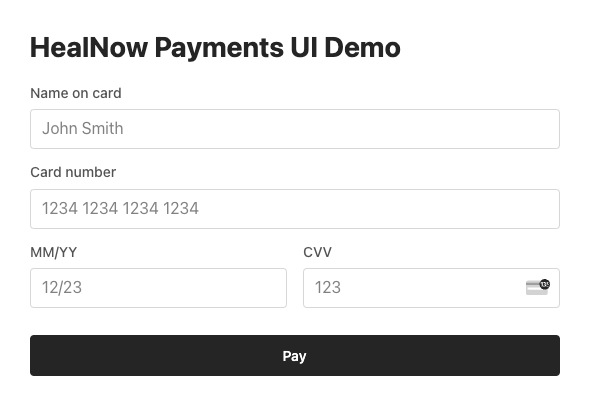

# HealNow Payments UI Demo

Example app implementing showcasing HealNow Payments UI.

## Running the demo

1. Clone the repo
2. Install npm dependencies `npm install`
3. Create `.env` file by copying `.env.sample` template   
3. Run express app with `npm start`
4. Demo can be accessed at http://localhost:3000/
